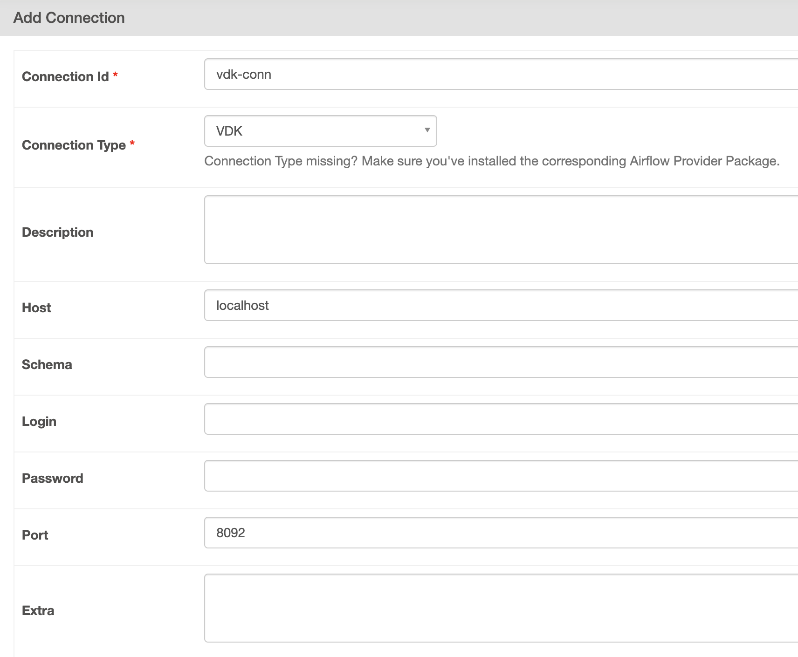
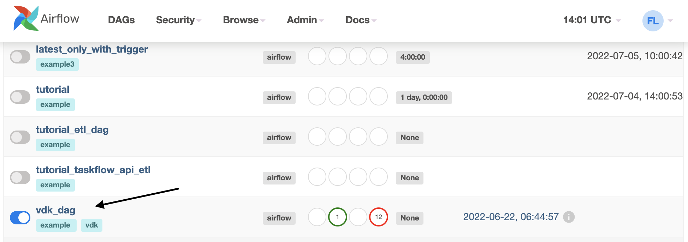
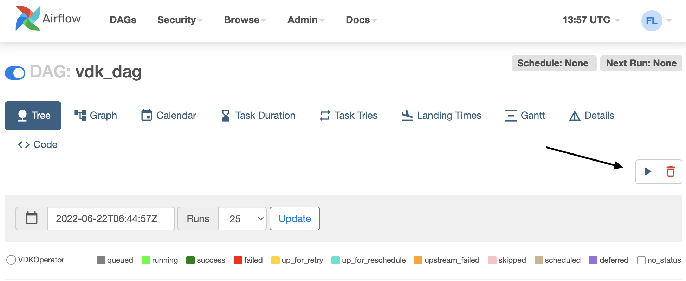

# Introduction

Today, we're announcing an integration between Versatile Data Kit and Apache Airflow, a popular workload scheduler. This blog post serves to provide an overview of the relevant parts of these two projects, how they integrate, and how to set up an instance of Airflow which will trigger deployed VDK jobs.

# Basic Concepts

## Apache Airflow Basics

Apache Airflow is "a platform to programmatically author, schedule and monitor workflows". It allows users to schedule workloads to be ran periodically, and also to build more complex workload structures by expressing them as directed acyclic graphs. The nodes of these graphs represent individual workloads, while the edges represent dependencies between workloads. This means that a workload which is 'pointed at' by another workload will only trigger if the previous workload completes successfully.
Workloads within Airflow code are represented by operators. Operators are Python objects, which means that they are highly flexible in terms of what work is done by the actual workload. Airflow offers many different operators by default, and users can develop their own if they need more specialized behaviour, as we have done here.
For more information on Apache Airflow, see [the official documentation here](https://airflow.apache.org/docs/apache-airflow/stable/index.html).

## Versatile Data Kit Basics

Versatile Data Kit allows users to develop and manage workloads called Data jobs. These jobs can be entirely SQL code, entirely Python code, or a mix of both, and can be run either locally, or be deployed to a Kubernetes environment and be managed by the VDK Control Service. Deployed jobs can be scheduled to run periodically using a cron-like scheduling format.
For more information on Versatile Data Kit see [the official documentation here](https://github.com/vmware/versatile-data-kit/wiki/Introduction).


# Integration Review

Our integration allows users to develop DAGs composed of tasks which trigger executions for deployed VDK Data jobs.

To integrate VDK with Apache Airflow, we've created the airflow-provider-vdk Python package which features two user-facing classes:
* A job-triggering operator, named VDKOperator. This operator can be used to trigger a job execution using a configured connection to an instance of the VDK Control Service, given a particular job name and job team. This operator can be set to run synchronously or asynchronously. In the first case, the operator will only complete after the job execution completes; additionally, it will only be considered successful if the job execution itself is successful. In the second case, the operator is considered successful if the job execution is successfully triggered with no consideration for whether the job passes successfully or not;
* A sensor, named VDKSensor, which pings an instance of the VDK Control Service. Given a particular job execution ID, this sensor can check whether a job execution has completed and is successful.

Given this integration, a user can now instantiate an Airflow DAG where each workload in this DAG triggers a particular deployed Data job. This allows for the expression and management of Data job dependencies, which was previously not possible.

# Setup Overview

If you haven't installed VDK already, you can do so by following [the instructions found here](https://github.com/vmware/versatile-data-kit/wiki/Installation#install-sdk).

In short - install kind, helm, and docker; make sure you have a working Python environment running Python 3.7+ and run `pip install quickstart-vdk` and then `vdk server —install`.

To install and set up a local instance of Airflow, follow [the instructions found here](https://airflow.apache.org/docs/apache-airflow/stable/start/local.html).

Then, install the VDK provider for Airflow by running `pip install airflow-provider-vdk`.

# Jobs deployment, DAG instatiation and triggering

First, you'll need to configure your connection to the deployed VDK Control Service. This can be done through the CLI, as well as through the web UI. From the 'Admin' dropdown menu, open the 'Connections' tab and press the 'Add a new connection' button. From there, name your connection appropriately (we'll go with `vdk-conn` for our purposes), set the connection type to `VDK`, and if using default parameters for the VDK Control Service instantiation, set the host to 'localhost' and the port to 8092 (note that if you're using a different instance of the Control Service, you'll have to specify a different host and port).



Alternatively, a connection can be set up through the `airflow` CLI using the following command:
```console
airflow connections add vdk-conn --conn-host localhost --conn-port 8092 --conn-type VDK
```

Next, make sure the jobs you want to include in your DAG are deployed and enabled. For the purposes of our tutorial, we'll be dealing with three Data jobs - `ingest-job1`, `ingest-job2`, `transform-job` - two of which will be ingesting data, and one which will be transforming the ingested data. We will not be discussing the exact implementations of these jobs - such details can be found in [the Examples section of our wiki here](https://github.com/vmware/versatile-data-kit/wiki/Examples).


The next steps is to set up the DAG, beginning with instantiating the DAG object:
```py
with DAG(
    'vdk_dag',
    schedule_interval=None,
    start_date=datetime(2021, 1, 1),
    catchup=False,
    tags=['vdk', 'example'],
) as dag:
```
Next, we'll instantiate the corresponding operator for each job:
```py
ingest_job1 = VDKOperator(
        conn_id='vdk-conn',
        job_name='ingest-job1',
        team_name='default',
        task_id='ingest-job1'
    )

    ingest_job2 = VDKOperator(
        conn_id='vdk-conn',
        job_name='ingest-job2',
        team_name='default',
        task_id='ingest-job2'
    )

    transform_job = VDKOperator(
        conn_id='vdk-conn',
        job_name='transform-job',
        team_name='default',
        task_id='transform-job'
    )
```
Finally, we'll describe the edges of our DAG:
```py
[ingest_job1, ingest_job2] >> transform_job
```
Where the two ingest jobs are triggered first, and if they both pass successfully, the transformation job is triggered.

Our overall DAG file looks like this:
```py
from airflow import DAG
from vdk_provider.operators.vdk import VDKOperator
from vdk_provider.sensors.vdk import VDKSensor
from datetime import datetime

with DAG(
    'vdk_dag',
    schedule_interval=None,
    start_date=datetime(2021, 1, 1),
    catchup=False,
    tags=['vdk', 'example'],
) as dag:
    ingest_job1 = VDKOperator(
        conn_id='vdk-conn',
        job_name='ingest-job1',
        team_name='default',
        task_id='ingest-job1'
    )

    ingest_job2 = VDKOperator(
        conn_id='vdk-conn',
        job_name='ingest-job2',
        team_name='default',
        task_id='ingest-job2'
    )

    transform_job = VDKOperator(
        conn_id='vdk-conn',
        job_name='transform-job',
        team_name='default',
        task_id='transform-job'
    )

    [ingest_job1, ingest_job2] >> transform_job
```
Next, we'll need to place this file in our dags directory. By default, on Linux and MacOS systems this will be in `~/airflow/dags` but it can be changed in Airflow's configuration file.
Once the file is located there, Airflow's scheduler will automatically pick it up and it will be available through the Airflow CLI and UI.



Finally, we need to trigger the DAG through the Airflow UI and observe the job executions.



# Next steps

For more information on Versatile Data Kit, please see [the official documentation](https://github.com/vmware/versatile-data-kit/wiki/Introduction) or [the Examples page](https://github.com/vmware/versatile-data-kit/wiki/Examples). For more information on Apache Airflow, please see [the official documentation](https://airflow.apache.org/docs/apache-airflow/stable/index.html).
